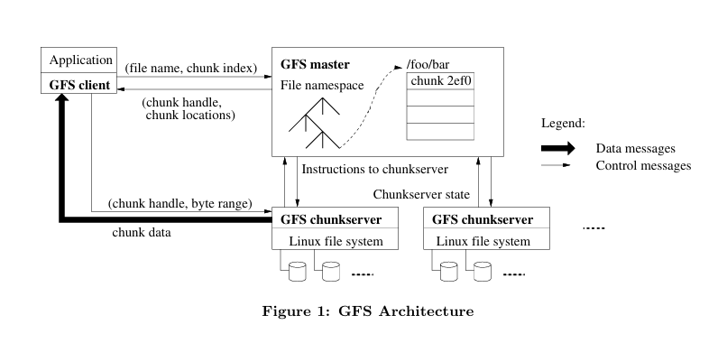

# **GFS**

**Table of Contents**

- [**GFS**](#gfs)
  - [**1. Introduction**](#1-introduction)
    - [**1.1 Component Failures**](#11-component-failures)
    - [**1.2 Huge Files**](#12-huge-files)
    - [**1.3 Append Only, No Over-Writes, No Random-Writes**](#13-append-only-no-over-writes-no-random-writes)
    - [**1.4 Relaxed Consistency**](#14-relaxed-consistency)
      - [**1.4.1 Strong Consistency?**](#141-strong-consistency)
    - [**1.5 Application Adaptation**](#15-application-adaptation)
    - [**1.6 Atomic Append Operation**](#16-atomic-append-operation)
    - [**1.7 Assumptions in Design**](#17-assumptions-in-design)
  - [**2. Architecture**](#2-architecture)
    - [**2.1 Cluster Structure**](#21-cluster-structure)
    - [**2.2 Chunk Division:**](#22-chunk-division)
      - [**2.2.1 Why?**](#221-why)
    - [**2.3 Chunk Replication:**](#23-chunk-replication)
    - [**2.4 Master Responsibilities:**](#24-master-responsibilities)
    - [**2.5 Client Interaction:**](#25-client-interaction)
    - [**2.6 Caching Policies:**](#26-caching-policies)
      - [**2.6.1 Why?**](#261-why)
  - [**3. Single Master**](#3-single-master)
    - [**3.1 Minimizing the Master's Involvement in Data R/W**](#31-minimizing-the-masters-involvement-in-data-rw)
    - [**3.2 Chunkservers cache Metadata for a limited time**](#32-chunkservers-cache-metadata-for-a-limited-time)
    - [**3.3 Simple Read**](#33-simple-read)
  - [**4. Chunk**](#4-chunk)
    - [**4.1 Chunk Size**](#41-chunk-size)
    - [**4.2 Why clients connect to chunkc over TCP?**](#42-why-clients-connect-to-chunkc-over-tcp)
    - [**4.3 Large file size disadvantages**](#43-large-file-size-disadvantages)
    - [**4.3.1 But, it is not a problem**](#431-but-it-is-not-a-problem)
  - [**5. Metadata**](#5-metadata)
    - [**5.1 The master does not store chunklocation information persistently**](#51-the-master-does-not-store-chunklocation-information-persistently)

## **1. Introduction**

### **1.1 Component Failures**

    Distributed systems often face the CAP theorem (Consistency, Availability, Partition Tolerance) trade-offs. The paper prioritizes availability and partition tolerance, which might come at the cost of strong consistency guarantees. This can lead to scenarios where some nodes may have stale data for a short period.

### **1.2 Huge Files**

    due to the nature of Google's specific workloads and requirements.

    data aggregation: web crawlers collect large datasets that are stored in massive files rather than numerous small files

    large datasets are efficient for: indexing the web, processing search queries, and analyzing large-scale datasets

    file System Overhead: Managing billions of small, KB-sized files introduces significant overhead in terms of metadata management and file system operations. Large files reduce the overhead associated with handling numerous small files.

    Performance Optimization: Large files allow for optimizations in I/O operations. For example, larger block sizes and fewer, more substantial read/write operations can be more efficient than handling numerous small operations.

    scalability for future: Designing for large files helps ensure the system can manage this growth effectively.

    reduce metadata overhead: By dealing with large files, the system reduces the amount of metadata it needs to store and manage

### **1.3 Append Only, No Over-Writes, No Random-Writes**

    "Random writes within a file are practically non-existent.": Random writes involve writing data to various, non-sequential locations within a file. This means updating or modifying data at arbitrary positions rather than appending data to the end.

    "Once written, the files are only read, and often only sequentially.": Immutability: After data is written to a file in GFS, it is not modified or updated. The written data remains unchanged, making the files effectively immutable.

    google applications mainly handle large continous data such log files, web crawls which by design need to be "append only"

    It’s simpler to ensure data is appended correctly without interfering with existing data, minimizing the risk of data corruption and ensuring atomicity.

    The cached data is less likely to be reused since new data is constantly being added, and the primary operations are writes rather than reads. So, caching has been disregarded.

### **1.4 Relaxed Consistency**

    Relaxed Consistency: GFS relaxes its consistency model to simplify the system design. Instead of guaranteeing strong consistency (where all clients see the same view of the data at all times), GFS opts for a weaker consistency model that is easier to implement and maintain.

#### **1.4.1 Strong Consistency?**

| Advantages                                                                                                        | Disadvantages                                                                                     |
| ----------------------------------------------------------------------------------------------------------------- | ------------------------------------------------------------------------------------------------- |
| Provides strong guarantees that all clients see the same data at all times, which can simplify application logic. | Much more complex to implement and maintain, especially in a distributed system.                  |
|                                                                                                                   | Performance overheads due to the need for synchronization and coordination across multiple nodes. |
|                                                                                                                   | Can lead to increased latency and reduced throughput.                                             |

### **1.5 Application Adaptation**

    Application Adaptation: Since the applications are co-designed with the file system, they can be built to handle this relaxed consistency, thus avoiding the complexities and overheads associated with strong consistency models.

### **1.6 Atomic Append Operation**

    Concurrency Without Complexity: The introduction of an atomic append operation allows multiple clients to append data to a file concurrently without needing additional synchronization. This simplifies concurrent writes and improves performance.

### **1.7 Assumptions in Design**

    Component Failures:

        - Built from inexpensive commodity components prone to failure.
        - Requires constant monitoring, error detection, fault tolerance, and prompt recovery.

    File Characteristics:

        - Stores a modest number of large files (few million files, typically 100 MB or larger, with multi-GB files being common).
        - Supports small files but does not optimize for them.

    Read Workloads:

        - Primarily large streaming reads (hundreds of KBs to 1 MB or more) and small random reads (a few KBs).
        - Applications often batch and sort small reads for efficiency.

    Write Workloads:

        - Many large, sequential writes that append data to files.
        - Files are seldom modified after being written.
        - Supports small writes at arbitrary positions but does not optimize for them.

    Concurrency:

        - Must handle multiple clients concurrently appending to the same file.
        - Ensures atomicity with minimal synchronization for efficient concurrent appends.

    Performance Focus:

        - High sustained bandwidth is prioritized over low latency.
        - Most target applications require high-rate bulk data processing rather than fast response times for individual operations.

## **2. Architecture**

### **2.1 Cluster Structure**

    Consists of a single master and multiple chunkservers.
    Accessible by multiple clients, typically commodity Linux machines.
    Chunkserver and client processes can run on the same machine if resources permit.

### **2.2 Chunk Division:**

    Files are divided into fixed-size chunks.
    Each chunk has a unique 64-bit chunk handle assigned by the master during creation.
    Chunks are stored on local disks of chunkservers as Linux files.

#### **2.2.1 Why?**

    It allows for a uniform approach to handling data regardless of the file's size, simplifying the system's design and management.

    Assigning a unique 64-bit chunk handle to each chunk ensures its immutability and global uniqueness. This handle serves as a reliable identifier for the chunk, allowing clients and the master to locate and access the chunk consistently across the distributed system.

    Chunk-based storage simplifies metadata management for the master. Instead of tracking individual blocks or bytes within a file, the master only needs to maintain metadata for the chunks, reducing the complexity and overhead associated with managing file metadata.

### **2.3 Chunk Replication:**

    Each chunk is replicated on multiple chunkservers for reliability.
    Default replication is three replicas, but users can specify different levels for different file namespace regions.

### **2.4 Master Responsibilities:**

    Maintains all file system metadata, including namespace, access control, file-to-chunk mapping, and chunk locations.
    Manages system-wide activities such as chunk lease, garbage collection, and chunk migration.
    Communicates periodically with each chunkserver via HeartBeat messages.

### **2.5 Client Interaction:**

    GFS client code implements the file system API.
    Communicates with master for metadata operations and directly with chunkservers for data access.
    Does not use POSIX API or Linux vnode layer, simplifying implementation.

### **2.6 Caching Policies:**

    Neither client nor chunkserver caches file data.
    Client caches metadata but not data, as most applications work with large files or have working sets too large to cache.
    Eliminating file data caching simplifies the system by avoiding cache coherence issues.
    Chunkservers do not need to cache file data since Linux's buffer cache handles frequently accessed data in memory.

#### **2.6.1 Why?**

    Most applications accessing files in GFS stream through huge files or have working sets that are too large to be effectively cached. This means that caching file data at the client or chunkserver level would offer little benefit since the majority of data accesses are sequential and cover large portions of the files.

    In distributed systems like GFS, maintaining consistency between cached copies of data across multiple nodes can be complex and resource-intensive. By eliminating file data caching, GFS simplifies the client and the overall system architecture, reducing the risk of cache coherence-related problems.

    GFS clients do cache metadata. Metadata caching allows clients to store information about file and chunk locations, access permissions, and other metadata, which helps optimize metadata-intensive operations such as file lookups and directory traversals.

    Chunkservers do not need to cache file data because chunks are stored as local files on disk. Instead, Linux's buffer cache handles caching of frequently accessed data in memory at the operating system level. This ensures that frequently accessed chunk data is efficiently cached in memory without the need for additional caching mechanisms in chunkservers.

## **3. Single Master**

### **3.1 Minimizing the Master's Involvement in Data R/W**

    If the master were also responsible for processing data reads and writes, it would significantly increase the processing overhead on the master node, potentially causing it to become overwhelmed with requests.

    Minimizing the involvement of the master in data reads and writes reduces the amount of network traffic directed towards the master node. Instead of routing all data traffic through the master, clients communicate directly with chunkservers to access data.

    Direct client-chunkserver communication for data reads and writes eliminates the additional latency introduced by client-master interactions.

### **3.2 Chunkservers cache Metadata for a limited time**

    The network environment in distributed systems can change rapidly due to various factors such as node failures, network congestion, or system reconfigurations

    In case of chunkservers' failures or network partitions, cached information about chunkservers may become outdated or invalid. By limiting the caching duration, clients can periodically refresh this information from the master, ensuring they always have up-to-date knowledge of the system's topology.

    If the cached information remains valid indefinitely, it could consume unnecessary memory or introduce additional overhead in managing stale cache entries

### **3.3 Simple Read**

## **4. Chunk**

### **4.1 Chunk Size**

    A strategy where storage space for chunks is allocated dynamically and extended only as needed. (prevents internal fragmentation)

    Internal fragmentation occurs when storage space is allocated to a file or chunk but remains unused, leading to inefficient use of storage resources.

### **4.2 Why clients connect to chunkc over TCP?**

    Establishing a TCP connection incurs an initial overhead in setting up the connection. However, once the connection is established, subsequent data transfers incur lower overhead compared to establishing new connections for each operation. This is because TCP connections maintain state information that eliminates the need for repeated handshakes and negotiation.

### **4.3 Large file size disadvantages**

    Hotspot Formation: In scenarios where a small file consists of only a few chunks, particularly if it's a frequently accessed file by many clients, the chunkservers storing those chunks may become hot spots.

    Resource Imbalance: Hot spots can lead to imbalanced resource utilization across the chunkserver nodes in the GFS cluster. Nodes storing hot chunks may experience higher load and resource consumption compared to others.

    Performance Degradation: Hot spots may degrade system performance by causing bottlenecks in data access. Clients accessing hot chunks may experience delays or increased latency due to contention for resources.

### **4.3.1 But, it is not a problem**

    Sequential Access: Most GFS applications tend to access large files sequentially, meaning that chunks are accessed in a predictable order without significant contention among clients.

    Reduced Hotspot Occurrence: Since clients typically access different parts of large files concurrently, the likelihood of multiple clients accessing the same chunks simultaneously is lower, reducing the occurrence of hot spots.

## **5. Metadata**

### **5.1 The master does not store chunklocation information persistently**

    GFS clusters can undergo dynamic changes, such as chunkserver additions or removals, which can alter the distribution of chunk replicas. By querying chunkserver information at startup or when changes occur, the master ensures it has the most up-to-date and accurate chunk location information.

