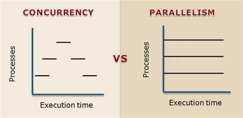
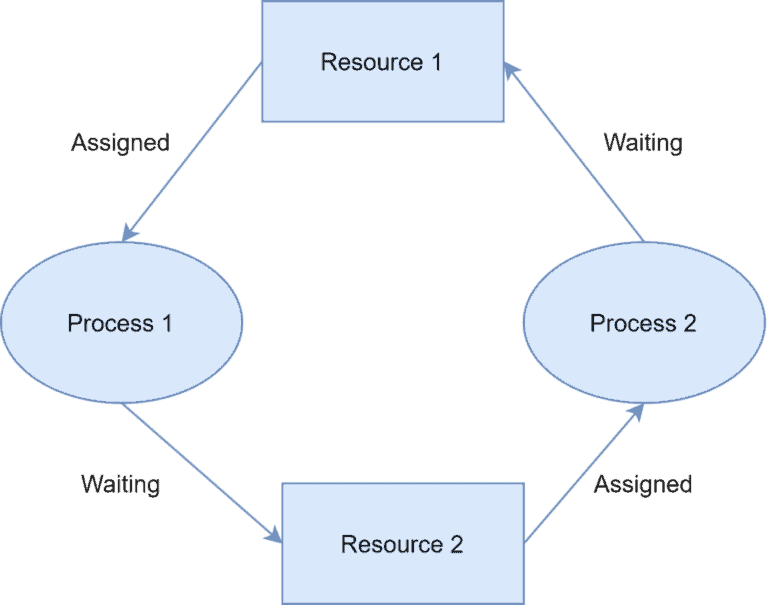
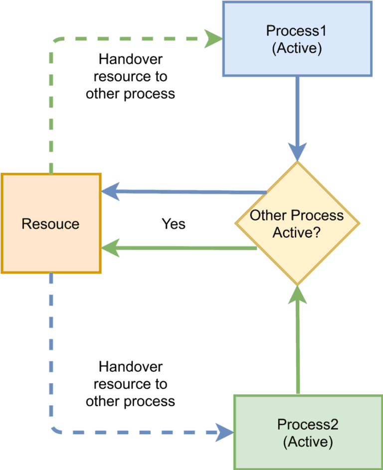
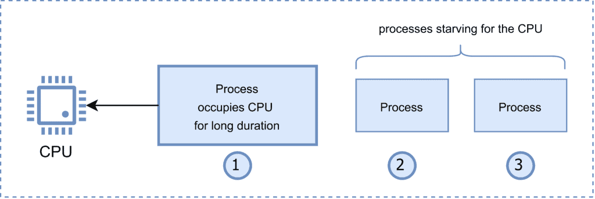
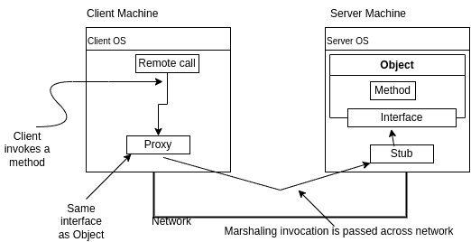

<div style="text-align: justify">

# **Theory**

**Table of Contents**

- [**Theory**](#theory)
  - [**1. Introduction**](#1-introduction)
    - [**1.1 Define**](#11-define)
    - [**1.2 Why not DS?**](#12-why-not-ds)
    - [**1.3 Why DS?**](#13-why-ds)
  - [**2. Concurrency and Parallel Processing**](#2-concurrency-and-parallel-processing)
    - [**2.1 Thread, Process and Fork**](#21-thread-process-and-fork)
    - [**2.2 Channels and Pipes**](#22-channels-and-pipes)
    - [**2.3 Locks**](#23-locks)
      - [**2.3.1 Example**](#231-example)
    - [**2.4 Deadlocks, Livelocks and Starvation**](#24-deadlocks-livelocks-and-starvation)
    - [**2.5 Race Conditions**](#25-race-conditions)
    - [**2.6 Blind Writes**](#26-blind-writes)
  - [**3. Communication and RPC**](#3-communication-and-rpc)
    - [**3.1 Latency and Bandwidth**](#31-latency-and-bandwidth)
    - [**3.2 Remote Procedure Calls (RPC)**](#32-remote-procedure-calls-rpc)
      - [**3.2.1 Example**](#321-example)
      - [**3.2.2 Invoking RPC**](#322-invoking-rpc)
      - [**3.2.3 Serialization and Marshalling**](#323-serialization-and-marshalling)
      - [**3.2.4 Protocol Buffer**](#324-protocol-buffer)
  - [**4. Models**](#4-models)

<div style="page-break-after: always;"></div>

## **1. Introduction**

### **1.1 Define**

    Multiple computers
    Common Task
    Client sees a single service

### **1.2 Why not DS?**

    Fault Tolerance is Hard ( a system as a whole continues to work, even when some parts are faulty)

    - Non reliable communication
    - Processes might crash
    - Coordinated and uncoordinated indeterministic   failures

### **1.3 Why DS?**

    Parallel or Concurrent
    Fault Tolerance
    Physical Requirements
    Isolation (Security)
    Scalability
    Resource Sharing
    Price / Performance Ratio
    Seamless Communication
    Abstraction of Computation


## **2. Concurrency and Parallel Processing**



|            | Single Core | Multi Core |
| ---------- | ----------- | ---------- |
| Concurrent | ✅           | ✅          |
| Parallel   | ❎           | ✅          |

### **2.1 Thread, Process and Fork**

    - Threads (of the same process) run in a shared memory space
    - Processes run in separate memory spaces.
    - Each process is started with a single thread, often called the primary thread, but can create additional threads from any of its threads.
    - A thread is a subset of the process.
    - A fork gives a copy of a process
    - A fork has its own memory space (not shared)

### **2.2 Channels and Pipes**

    - Pipes are channels that connect processes for communication.
    - They have a write end for sending bytes and a read end for receiving these bytes in FIFO
    - Channels act like pipes between two processes or threads.
    - One process puts data into the channel, and the other process retrieves it.
    - Channels can be used for communication between concurrent threads within the same process
    - They are simpler to use than pipes because they don’t involve file descriptors or system calls.
    - Pipes are typically unidirectional. Data flows from the write end to the read end. To achieve full duplex communication (both directions simultaneously), you’d need two pipes—one for each direction.
    -  Channels can be bidirectional, allowing data to flow in both directions. Channels can handle simultaneous communication in both directions within the same channel.


### **2.3 Locks**

    - A Lock can only give access to a single thread
    - A mutually exclusive lock can give access to multiple threads

#### **2.3.1 Example**

    Binary Lock

```c
// Binary Lock
#include <stdio.h>
#include <pthread.h>

pthread_mutex_t lock;

void* critical_section(void* arg) {
    int thread_id = *((int*)arg);

    pthread_mutex_lock(&lock); // Acquire the binary lock
    printf("Thread %d: Entered critical section\n", thread_id);
    // Critical section code
    pthread_mutex_unlock(&lock); // Release the binary lock

    free(arg);
    return NULL;
}

int main() {
    pthread_t threads[5];
    int* thread_ids[5];

    pthread_mutex_init(&lock, NULL); // Initialize the binary lock

    // Create and start 5 threads
    for (int i = 0; i < 5; i++) {
        thread_ids[i] = malloc(sizeof(int));
        *thread_ids[i] = i;
        pthread_create(&threads[i], NULL, critical_section, thread_ids[i]);
    }

    // Wait for all threads to finish
    for (int i = 0; i < 5; i++) {
        pthread_join(threads[i], NULL);
    }

    pthread_mutex_destroy(&lock); // Destroy the binary lock

    return 0;
}
```

    Shared/Exclusive Lock

```c
// Shared/Exclusive Lock
#include <stdio.h>
#include <pthread.h>

pthread_rwlock_t rwlock;

void* read_shared(void* arg) {
    pthread_rwlock_rdlock(&rwlock); // Acquire a shared read lock
    printf("Thread %ld: Reading shared resource\n", pthread_self());
    // Read from shared resource
    pthread_rwlock_unlock(&rwlock); // Release the shared read lock
    return NULL;
}

void* write_exclusive(void* arg) {
    pthread_rwlock_wrlock(&rwlock); // Acquire an exclusive write lock
    printf("Thread %ld: Writing to shared resource\n", pthread_self());
    // Write to shared resource
    pthread_rwlock_unlock(&rwlock); // Release the exclusive write lock
    return NULL;
}

int main() {
    pthread_t threads[5];

    pthread_rwlock_init(&rwlock, NULL); // Initialize the shared-exclusive lock

    // Create threads for shared read access
    pthread_create(&threads[0], NULL, read_shared, NULL);
    pthread_create(&threads[1], NULL, read_shared, NULL);
    pthread_create(&threads[2], NULL, read_shared, NULL);

    // Create threads for exclusive write access
    pthread_create(&threads[3], NULL, write_exclusive, NULL);
    pthread_create(&threads[4], NULL, write_exclusive, NULL);

    // Wait for all threads to finish
    for (int i = 0; i < 5; i++) {
        pthread_join(threads[i], NULL);
    }

    pthread_rwlock_destroy(&rwlock); // Destroy the shared-exclusive lock

    return 0;
}
```

### **2.4 Deadlocks, Livelocks and Starvation**

    A deadlock is a state in which each member of a group of actions, is waiting for some other member to release a lock.

    A livelock is similar to a deadlock, except that the states of the processes involved in the livelock constantly change with regard to one another, none progressing.





### **2.5 Race Conditions**

    A race condition occurs when two or more threads can access shared data and attempt to change it simultaneously.
    Can prevent using locks to ensure only one thread accesses the shared data at a time.
    e.g.: Lower value than Expected (MapReduce)

### **2.6 Blind Writes**

    Blind writes occur when threads write to shared memory without proper synchronization.
    Threads may overwrite each other’s changes, leading to incorrect results.
    The final value of shared variable depends on which thread executes last.
    Can prevent using properly syncing all threads.
    e.g.: Higher value than Expected (MapReduce)


## **3. Communication and RPC**

### **3.1 Latency and Bandwidth**

    - Latency: Time until message arrives
    - Bandwidth: Data volume per unit time 

### **3.2 Remote Procedure Calls (RPC)**

| Layer   | Name         | Protocols                                      |
| ------- | ------------ | ---------------------------------------------- |
| Layer 7 | Application  | SMTP, HTTP, FTP, POP3, SNMP                    |
| Layer 6 | Presentation | MPEG, ASCH, SSL, TLS                           |
| Layer 5 | Session      | NetBIOS, SAP                                   |
| Layer 4 | Transport    | TCP, UDP                                       |
| Layer 3 | Network      | IPV5, IPV6, ICMP, IPSEC, ARP, MPLS.            |
| Layer 2 | Data Link    | RAPA, PPP, Frame Relay, ATM, Fiber Cable, etc. |
| Layer 1 | Physical     | RS232, 100BaseTX, ISDN, 11.                    |

    A communication protocol that enables a program to execute a subroutine or procedure on a remote system over a network.

#### **3.2.1 Example**

    In this example, we have a Calculator type that represents a calculator instance. It has a single method Add that takes two integers and returns their sum.

    In the main function, we create a new instance of Calculator, register it with the RPC server using rpc.Register(calculator), and start the RPC server on port 8000.

```go
// server.go
package main

import (
	"fmt"
	"net"
	"net/rpc"
)

type Calculator int

func (c *Calculator) Add(x, y int) (int, error) {
	return int(*c) + x + y, nil
}

func main() {
	calculator := new(Calculator)
	rpc.Register(calculator)

	listener, err := net.Listen("tcp", ":8000")
	if err != nil {
		fmt.Println("Failed to listen:", err)
		return
	}
	defer listener.Close()

	fmt.Println("Listening on port 8000...")
	rpc.Accept(listener)
}
```

    In the client code, we create a new client connection to the RPC server using rpc.Dial("tcp", "localhost:8000").

    We then call the Add method on the remote server using client.Call("Calculator.Add", []int{3, 5}, &result). The first argument is the name of the remote method, the second argument is the input arguments (an array of integers in this case), and the third argument is a pointer to a variable where the result will be stored.

```go
package main

import (
	"fmt"
	"net/rpc"
)

func main() {
	client, err := rpc.Dial("tcp", "localhost:8000")
	if err != nil {
		fmt.Println("Failed to connect:", err)
		return
	}
	defer client.Close()

	var result int
	err = client.Call("Calculator.Add", []int{3, 5}, &result)
	if err != nil {
		fmt.Println("Failed to call Add:", err)
	} else {
		fmt.Printf("3 + 5 = %d\n", result)
	}
}
```

    Output

```bash
(Server terminal)
Listening on port 8000...

(Client terminal)
3 + 5 = 8
```

#### **3.2.2 Invoking RPC**

| Protocol                                | Description                                                                                                                                                                                     |
| --------------------------------------- | ----------------------------------------------------------------------------------------------------------------------------------------------------------------------------------------------- |
| **TCP (Transmission Control Protocol)** | reliable, connection-oriented, guarantees the delivery of data packets in the correct order, provides error-checking mechanisms.                                                                |
| **HTTP (Hypertext Transfer Protocol)**  | widely used protocol, useful when the client and server are separated by firewalls or proxy servers, often used in web services and RESTful APIs.                                               |
| **gRPC (Google Remote Procedure Call)** | high-performance, uses HTTP/2, multiplexing, header compression, bidirectional streaming. efficient, scalable, and language-agnostic.                                                           |
| **WebSocket**                           | persistent, bidirectional communication channel between a client and a server over a single TCP connection, allowing real-time data exchange without the overhead of traditional HTTP requests. |

#### **3.2.3 Serialization and Marshalling**




    Serialization is persisting an object into a state independent of its execution environment. During serialization, the data is saved (in memory or physically) in a raw format, such as byte arrays or binary data. Deserialization is the reconstruction of the original object from the serialized data.

    Marshaling is moving an object or method call into another execution part. It is more about the interoperability of objects between programs or threads. It can also involve serialization during its operation. Therefore, serialization is usually part of marshaling.


#### **3.2.4 Protocol Buffer**

```bash
message PaymentRequest{
	message Card{
		required string cardNumber 	=    1; 
		optional int32 expiryMonth 	=    2;
		optional int32 expiryYear 	=    3;
		optional int32 CVC		=    4;
	}
}

message PaymentStatus{
	required bool success 		=   1;
	optional string errorMessage		=   2;
}
service PaymentService{
	rpc ProcessPayment(PaymentRequest) return (PaymentStatus) {}
}
```

## **4. Models**

</div>