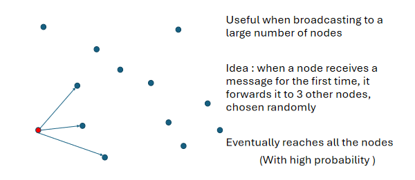

<div style="text-align: justify">

# **Theory**

**Table of Contents**

- [**Theory**](#theory)
  - [**1. Introduction**](#1-introduction)
    - [**1.1 Define**](#11-define)
    - [**1.2 Why not DS?**](#12-why-not-ds)
    - [**1.3 Why DS?**](#13-why-ds)
  - [**2. Concurrency and Parallel Processing**](#2-concurrency-and-parallel-processing)
    - [**2.1 Thread, Process and Fork**](#21-thread-process-and-fork)
    - [**2.2 Channels and Pipes**](#22-channels-and-pipes)
    - [**2.3 Locks**](#23-locks)
      - [**2.3.1 Example**](#231-example)
    - [**2.4 Deadlocks, Livelocks and Starvation**](#24-deadlocks-livelocks-and-starvation)
    - [**2.5 Race Conditions**](#25-race-conditions)
    - [**2.6 Blind Writes**](#26-blind-writes)
  - [**3. Communication and RPC**](#3-communication-and-rpc)
    - [**3.1 Latency and Bandwidth**](#31-latency-and-bandwidth)
    - [**3.2 Remote Procedure Calls (RPC)**](#32-remote-procedure-calls-rpc)
      - [**3.2.1 Example**](#321-example)
      - [**3.2.2 Invoking RPC**](#322-invoking-rpc)
      - [**3.2.3 Serialization and Marshalling**](#323-serialization-and-marshalling)
      - [**3.2.4 Protocol Buffer**](#324-protocol-buffer)
  - [**4. Models**](#4-models)
    - [**4.1 Two Generals Problem**](#41-two-generals-problem)
    - [**4.2 Byzantine Generals Problem**](#42-byzantine-generals-problem)
    - [**4.3 Systems Models**](#43-systems-models)
    - [**4.4 Network Behaviour**](#44-network-behaviour)
    - [**4.5 Node Behaviour**](#45-node-behaviour)
    - [**4.6 Time Behaviour**](#46-time-behaviour)
    - [**4.7 Violations of Synchrony**](#47-violations-of-synchrony)
      - [**4.7.1 Congestion**](#471-congestion)
      - [**4.7.2 Contention**](#472-contention)
      - [**4.7.3 Stop the World Garbage Collection**](#473-stop-the-world-garbage-collection)
      - [**4.7.4 Page Fault and Thrashing**](#474-page-fault-and-thrashing)
      - [**4.7.5 Priority Inversion**](#475-priority-inversion)
    - [**4.8 Availability**](#48-availability)
    - [**4.9 Faliure Detection**](#49-faliure-detection)
  - [**5. Time**](#5-time)
    - [**5.1 Time for Distributed Systems**](#51-time-for-distributed-systems)
    - [**5.2 Physical Clocks**](#52-physical-clocks)
    - [**5.3 Atomic Clocks**](#53-atomic-clocks)
    - [**5.4 Skew and Drift**](#54-skew-and-drift)
    - [**5.5 Logical Clocks**](#55-logical-clocks)
    - [**5.6 Leap Seconds**](#56-leap-seconds)
    - [**5.7 Time Sync, NTP and PTP**](#57-time-sync-ntp-and-ptp)
      - [**5.7.1 Client Sever Sync**](#571-client-sever-sync)
    - [**5.8 Cristian's Algorithm**](#58-cristians-algorithm)
    - [**5.9 Berkeley Algorithm**](#59-berkeley-algorithm)
    - [**5.10 Time-of-Day and Monotonic Clocks**](#510-time-of-day-and-monotonic-clocks)
  - [**6. Ordering**](#6-ordering)
    - [**6.1 Event**](#61-event)
    - [**6.2 Message**](#62-message)
    - [**6.3 Sent Order**](#63-sent-order)
    - [**6.4 Recieved Order**](#64-recieved-order)
    - [**6.5 Issues in Ordering**](#65-issues-in-ordering)
    - [**6.6 Happens-Before Relationship**](#66-happens-before-relationship)
    - [**6.7 Causality**](#67-causality)
    - [**6.8 Lamport Clock**](#68-lamport-clock)
    - [**6.9 Vector Clock**](#69-vector-clock)
  - [**7. Broadcast Protocols**](#7-broadcast-protocols)
    - [**7.1 Unicast**](#71-unicast)
    - [**7.2 Broadcast**](#72-broadcast)
    - [**7.3 Multicast**](#73-multicast)
    - [**7.4 Point-to-Point Communication (Non-IP Multicast)**](#74-point-to-point-communication-non-ip-multicast)
    - [**7.5 Best Effort vs. Reliable Communication**](#75-best-effort-vs-reliable-communication)
    - [**7.6 Issues in Message Delivery**](#76-issues-in-message-delivery)
    - [**7.7 Asynchronous, Partially Synchronous Timing Models**](#77-asynchronous-partially-synchronous-timing-models)
    - [**7.8 Eager Reliable Broadcast**](#78-eager-reliable-broadcast)
    - [**7.9 Gossip/Epidemic Protocol**](#79-gossipepidemic-protocol)
    - [**7.10 Reliable Broadcast Paradigm**](#710-reliable-broadcast-paradigm)
      - [**7.10.1 FIFO**](#7101-fifo)
      - [**7.10.2 Causal**](#7102-causal)
      - [**7.10.3 Total Order**](#7103-total-order)
      - [**7.10.4 FIFO Total Order**](#7104-fifo-total-order)
    - [**7.11 Implementing Fault Tolerance in Broadcast Protocols**](#711-implementing-fault-tolerance-in-broadcast-protocols)
  - [**8. Replication**](#8-replication)
    - [**8.1 Probability of Faults in Replication**](#81-probability-of-faults-in-replication)
    - [**8.2 Availability and Faultiness**](#82-availability-and-faultiness)
    - [**8.3 Retry and Deduplication**](#83-retry-and-deduplication)
    - [**8.4 Idempotence**](#84-idempotence)
    - [**8.5 Retry Semantics**](#85-retry-semantics)
      - [**8.5.1 At Most Once**](#851-at-most-once)
      - [**8.5.2 At Least Once**](#852-at-least-once)
      - [**8.5.3 Exactly Once**](#853-exactly-once)
    - [**8.6 Timestamps and Tombstones**](#86-timestamps-and-tombstones)
    - [**8.8 Replica Reconciling**](#88-replica-reconciling)
    - [**8.9 Concurrent Writes by Different Clients**](#89-concurrent-writes-by-different-clients)
    - [**8.10 Read After Write Consistency (RAW)**](#810-read-after-write-consistency-raw)
      - [**8.10.1 Strategies to Achieve RAW Consistency**](#8101-strategies-to-achieve-raw-consistency)
    - [**8.11 Quorum**](#811-quorum)
    - [**8.12 State Machine Replication**](#812-state-machine-replication)
      - [**8.12.1 Limitations**](#8121-limitations)
    - [**8.13 Leaders for Consensus**](#813-leaders-for-consensus)
  - [**9. Consistency in Replicas**](#9-consistency-in-replicas)
    - [**9.1 What is consistency in replicas?**](#91-what-is-consistency-in-replicas)
    - [**9.2 Distributed Transactions**](#92-distributed-transactions)
    - [**9.3 Atomic Commit vs Consensus**](#93-atomic-commit-vs-consensus)
    - [**9.4 Two-Phase Commit (2PC)**](#94-two-phase-commit-2pc)
      - [**9.4.1 Commit Phase Flow**](#941-commit-phase-flow)
      - [**9.4.2 Coordinator in Two-Phase Commit**](#942-coordinator-in-two-phase-commit)
      - [**9.4.3 Algorithm for Fault Tolerant 2PC**](#943-algorithm-for-fault-tolerant-2pc)
  - [**10. Linearizability**](#10-linearizability)
    - [**10.1 Concept of Linearizability**](#101-concept-of-linearizability)
    - [**10.2 Linearizability in Shared Memory Concurrency**](#102-linearizability-in-shared-memory-concurrency)
    - [**10.3 Linearizability vs. Serializability**](#103-linearizability-vs-serializability)
    - [**10.4 Abstracting Internals**](#104-abstracting-internals)
    - [**10.5 Timing Dependencies**](#105-timing-dependencies)
      - [**10.5.1 Overlapping Operations**](#1051-overlapping-operations)
    - [**10.6 Quorum Reads and Writes Insufficient for Linearizability**](#106-quorum-reads-and-writes-insufficient-for-linearizability)
    - [**10.7 Ensuring Linearizability with Read Repair**](#107-ensuring-linearizability-with-read-repair)
    - [**10.8 Compare-and-Swap (CAS) Operations**](#108-compare-and-swap-cas-operations)
    - [**10.9 Algorithm**](#109-algorithm)
    - [**10.10 Issues of Linearizability**](#1010-issues-of-linearizability)
  - [**11. Eventual Consistency**](#11-eventual-consistency)
    - [**11.1 Illustration of Eventual Consistency: Calendar App**](#111-illustration-of-eventual-consistency-calendar-app)
    - [**11.2 CAP Theorem**](#112-cap-theorem)
    - [**11.3 Formalizing Eventual Consistency and Strong Eventual Consistency**](#113-formalizing-eventual-consistency-and-strong-eventual-consistency)
    - [**11.4 Understanding Eventual Consistency**](#114-understanding-eventual-consistency)
      - [**11.4.1 Strong Eventual Consistency:**](#1141-strong-eventual-consistency)
      - [**11.4.2 Properties of Eventual Consistency:**](#1142-properties-of-eventual-consistency)
      - [**11.4.3 Challenges with Eventual Consistency:**](#1143-challenges-with-eventual-consistency)
      - [**11.4.4 Recap of Consistency Models:**](#1144-recap-of-consistency-models)
  - [**12. Concurrency Control**](#12-concurrency-control)
    - [**12.1 Operation Based CRDT**](#121-operation-based-crdt)
      - [**12.1.1 Algorithm**](#1211-algorithm)
    - [**12.2 State Based CRDT**](#122-state-based-crdt)
      - [**12.2.1 Algorithm**](#1221-algorithm)
    - [**12.3 Opearational Transformations**](#123-opearational-transformations)
    - [**12.4 Operation Based Text-CRDT**](#124-operation-based-text-crdt)
      - [**12.4.1 Alogrithm**](#1241-alogrithm)
    - [**12.5 Why Causal Broadcast for Operation Based Text-CRDT?**](#125-why-causal-broadcast-for-operation-based-text-crdt)

<div style="page-break-after: always;"></div>

## **1. Introduction**

### **1.1 Define**

    Multiple computers
    Common Task
    Client sees a single service

### **1.2 Why not DS?**

    Fault Tolerance is Hard ( a system as a whole continues to work, even when some parts are faulty)

    - Non reliable communication
    - Processes might crash
    - Coordinated and uncoordinated indeterministic   failures

### **1.3 Why DS?**

    Parallel or Concurrent
    Fault Tolerance
    Physical Requirements
    Isolation (Security)
    Scalability
    Resource Sharing
    Price / Performance Ratio
    Seamless Communication
    Abstraction of Computation


## **2. Concurrency and Parallel Processing**


|            | Single Core | Multi Core |
| ---------- | ----------- | ---------- |
| Concurrent | ✅           | ✅          |
| Parallel   | ❎           | ✅          |

### **2.1 Thread, Process and Fork**

    - Threads (of the same process) run in a shared memory space
    - Processes run in separate memory spaces.
    - Each process is started with a single thread, often called the primary thread, but can create additional threads from any of its threads.
    - A thread is a subset of the process.
    - A fork gives a copy of a process
    - A fork has its own memory space (not shared)

### **2.2 Channels and Pipes**

    - Pipes are channels that connect processes for communication.
    - They have a write end for sending bytes and a read end for receiving these bytes in FIFO
    - Channels act like pipes between two processes or threads.
    - One process puts data into the channel, and the other process retrieves it.
    - Channels can be used for communication between concurrent threads within the same process
    - They are simpler to use than pipes because they don’t involve file descriptors or system calls.
    - Pipes are typically unidirectional. Data flows from the write end to the read end. To achieve full duplex communication (both directions simultaneously), you’d need two pipes—one for each direction.
    -  Channels can be bidirectional, allowing data to flow in both directions. Channels can handle simultaneous communication in both directions within the same channel.


### **2.3 Locks**

    - A Lock can only give access to a single thread
    - A mutually exclusive lock can give access to multiple threads

#### **2.3.1 Example**

    Binary Lock

```c
// Binary Lock
#include <stdio.h>
#include <pthread.h>

pthread_mutex_t lock;

void* critical_section(void* arg) {
    int thread_id = *((int*)arg);

    pthread_mutex_lock(&lock); // Acquire the binary lock
    printf("Thread %d: Entered critical section\n", thread_id);
    // Critical section code
    pthread_mutex_unlock(&lock); // Release the binary lock

    free(arg);
    return NULL;
}

int main() {
    pthread_t threads[5];
    int* thread_ids[5];

    pthread_mutex_init(&lock, NULL); // Initialize the binary lock

    // Create and start 5 threads
    for (int i = 0; i < 5; i++) {
        thread_ids[i] = malloc(sizeof(int));
        *thread_ids[i] = i;
        pthread_create(&threads[i], NULL, critical_section, thread_ids[i]);
    }

    // Wait for all threads to finish
    for (int i = 0; i < 5; i++) {
        pthread_join(threads[i], NULL);
    }

    pthread_mutex_destroy(&lock); // Destroy the binary lock

    return 0;
}
```

    Shared/Exclusive Lock

```c
// Shared/Exclusive Lock
#include <stdio.h>
#include <pthread.h>

pthread_rwlock_t rwlock;

void* read_shared(void* arg) {
    pthread_rwlock_rdlock(&rwlock); // Acquire a shared read lock
    printf("Thread %ld: Reading shared resource\n", pthread_self());
    // Read from shared resource
    pthread_rwlock_unlock(&rwlock); // Release the shared read lock
    return NULL;
}

void* write_exclusive(void* arg) {
    pthread_rwlock_wrlock(&rwlock); // Acquire an exclusive write lock
    printf("Thread %ld: Writing to shared resource\n", pthread_self());
    // Write to shared resource
    pthread_rwlock_unlock(&rwlock); // Release the exclusive write lock
    return NULL;
}

int main() {
    pthread_t threads[5];

    pthread_rwlock_init(&rwlock, NULL); // Initialize the shared-exclusive lock

    // Create threads for shared read access
    pthread_create(&threads[0], NULL, read_shared, NULL);
    pthread_create(&threads[1], NULL, read_shared, NULL);
    pthread_create(&threads[2], NULL, read_shared, NULL);

    // Create threads for exclusive write access
    pthread_create(&threads[3], NULL, write_exclusive, NULL);
    pthread_create(&threads[4], NULL, write_exclusive, NULL);

    // Wait for all threads to finish
    for (int i = 0; i < 5; i++) {
        pthread_join(threads[i], NULL);
    }

    pthread_rwlock_destroy(&rwlock); // Destroy the shared-exclusive lock

    return 0;
}
```

### **2.4 Deadlocks, Livelocks and Starvation**

    A deadlock is a state in which each member of a group of actions, is waiting for some other member to release a lock.

    A livelock is similar to a deadlock, except that the states of the processes involved in the livelock constantly change with regard to one another, none progressing.


### **2.5 Race Conditions**

    A race condition occurs when two or more threads can access shared data and attempt to change it simultaneously.
    Can prevent using locks to ensure only one thread accesses the shared data at a time.
    e.g.: Lower value than Expected (MapReduce)

### **2.6 Blind Writes**

    Blind writes occur when threads write to shared memory without proper synchronization.
    Threads may overwrite each other’s changes, leading to incorrect results.
    The final value of shared variable depends on which thread executes last.
    Can prevent using properly syncing all threads.
    e.g.: Higher value than Expected (MapReduce)


## **3. Communication and RPC**

### **3.1 Latency and Bandwidth**

    - Latency: Time until message arrives
    - Bandwidth: Data volume per unit time 

### **3.2 Remote Procedure Calls (RPC)**

| Layer   | Name         | Protocols                                      |
| ------- | ------------ | ---------------------------------------------- |
| Layer 7 | Application  | SMTP, HTTP, FTP, POP3, SNMP                    |
| Layer 6 | Presentation | MPEG, ASCH, SSL, TLS                           |
| Layer 5 | Session      | NetBIOS, SAP                                   |
| Layer 4 | Transport    | TCP, UDP                                       |
| Layer 3 | Network      | IPV5, IPV6, ICMP, IPSEC, ARP, MPLS.            |
| Layer 2 | Data Link    | RAPA, PPP, Frame Relay, ATM, Fiber Cable, etc. |
| Layer 1 | Physical     | RS232, 100BaseTX, ISDN, 11.                    |

    A communication protocol that enables a program to execute a subroutine or procedure on a remote system over a network.

#### **3.2.1 Example**

    In this example, we have a Calculator type that represents a calculator instance. It has a single method Add that takes two integers and returns their sum.

    In the main function, we create a new instance of Calculator, register it with the RPC server using rpc.Register(calculator), and start the RPC server on port 8000.

```go
// server.go
package main

import (
	"fmt"
	"net"
	"net/rpc"
)

type Calculator int

func (c *Calculator) Add(x, y int) (int, error) {
	return int(*c) + x + y, nil
}

func main() {
	calculator := new(Calculator)
	rpc.Register(calculator)

	listener, err := net.Listen("tcp", ":8000")
	if err != nil {
		fmt.Println("Failed to listen:", err)
		return
	}
	defer listener.Close()

	fmt.Println("Listening on port 8000...")
	rpc.Accept(listener)
}
```

    In the client code, we create a new client connection to the RPC server using rpc.Dial("tcp", "localhost:8000").

    We then call the Add method on the remote server using client.Call("Calculator.Add", []int{3, 5}, &result). The first argument is the name of the remote method, the second argument is the input arguments (an array of integers in this case), and the third argument is a pointer to a variable where the result will be stored.

```go
package main

import (
	"fmt"
	"net/rpc"
)

func main() {
	client, err := rpc.Dial("tcp", "localhost:8000")
	if err != nil {
		fmt.Println("Failed to connect:", err)
		return
	}
	defer client.Close()

	var result int
	err = client.Call("Calculator.Add", []int{3, 5}, &result)
	if err != nil {
		fmt.Println("Failed to call Add:", err)
	} else {
		fmt.Printf("3 + 5 = %d\n", result)
	}
}
```

    Output

```bash
(Server terminal)
Listening on port 8000...

(Client terminal)
3 + 5 = 8
```

#### **3.2.2 Invoking RPC**

| Protocol                                | Description                                                                                                                                                                                     |
| --------------------------------------- | ----------------------------------------------------------------------------------------------------------------------------------------------------------------------------------------------- |
| **TCP (Transmission Control Protocol)** | reliable, connection-oriented, guarantees the delivery of data packets in the correct order, provides error-checking mechanisms.                                                                |
| **HTTP (Hypertext Transfer Protocol)**  | widely used protocol, useful when the client and server are separated by firewalls or proxy servers, often used in web services and RESTful APIs.                                               |
| **gRPC (Google Remote Procedure Call)** | high-performance, uses HTTP/2, multiplexing, header compression, bidirectional streaming. efficient, scalable, and language-agnostic.                                                           |
| **WebSocket**                           | persistent, bidirectional communication channel between a client and a server over a single TCP connection, allowing real-time data exchange without the overhead of traditional HTTP requests. |

#### **3.2.3 Serialization and Marshalling**


    Serialization is persisting an object into a state independent of its execution environment. During serialization, the data is saved (in memory or physically) in a raw format, such as byte arrays or binary data. Deserialization is the reconstruction of the original object from the serialized data.

    Marshaling is moving an object or method call into another execution part. It is more about the interoperability of objects between programs or threads. It can also involve serialization during its operation. Therefore, serialization is usually part of marshaling.


#### **3.2.4 Protocol Buffer**

```bash
message PaymentRequest{
	message Card{
		required string cardNumber 	=    1; 
		optional int32 expiryMonth 	=    2;
		optional int32 expiryYear 	=    3;
		optional int32 CVC		=    4;
	}
}

message PaymentStatus{
	required bool success 		=   1;
	optional string errorMessage		=   2;
}
service PaymentService{
	rpc ProcessPayment(PaymentRequest) return (PaymentStatus) {}
}
```

## **4. Models**

### **4.1 Two Generals Problem**


TCP is reliable, but doesn't solve two generals problem.


### **4.2 Byzantine Generals Problem**


    - Up to f generals might behave maliciously
    - Honest generals don’t know who the malicious ones are
    - The malicious generals may collude
    - Nevertheless, honest generals must agree on plan

    need 3f+1 generals in total to tolerate f malicious generals (<1/3 may be malicious)

### **4.3 Systems Models**

    - Network behavior ( messages may be loss)
	- Node behavior (crashes / faults ) 
	- Time behavior  (latency)

### **4.4 Network Behaviour**

    - Reliable (perfect) links: Message is received if and only id it is sent 
    - Fair-loss links: Message may or be lost, duplicated, or reordered. if kept retrying message eventually gets through 
    - Arbitrary links: A malicious adversity may interfere with messages (eavesdrop, modify, drop, spoof, reply)

    - Network partitioning : some links dropping/ delaying all messages for extended period of time 

### **4.5 Node Behaviour**

    - Crash-Stop: A node is faulty if it crashes (at any time). After crashing, it stops execution (forever)
    - Crash-Recovery: A node may crash at any moment, losing its in-memory (volatite) 	state. It may resume executing sometime later 
    - Byzantine (fail-arbitrary): A node is faulty if it deviates from the algorithm, Faulty nodes may do anything, including crashing or malicious

### **4.6 Time Behaviour**

    - Synchronous: Message latency no greater than a known upper bound. Nodes execute algorithm at a known speed
    - Partially synchronous: System is asynchronous for some finite ( but, unknown) period of 	time, Synchronous otherwise
    - Asynchronous: Messages can be delayed arbitrarily. Nodes can pause execution arbitrarily. No timing guaranties 

### **4.7 Violations of Synchrony**
    
    Networks
      - predictive latency
      - Message loss requiring retry 
      - Congestion/ contention causing queueing 
      - Network/route reconfiguration 

    Nodes
      - predictable speed
      - Operating system scheduling issues (priority inversion)
      - Stop-the-world garbed collection pause 
      - Page fault (trashing)


#### **4.7.1 Congestion**

    - Congestion occurs when there is too much traffic on the network, and the available resources (like bandwidth or buffers) are not enough to handle it.
    - It causes delays, packet loss, and reduced throughput (data transfer rate).
    - Congestion can happen due to high traffic volumes, sudden traffic bursts, inefficient routing, or network failures.

#### **4.7.2 Contention**

    - Contention happens when multiple devices or processes try to access or use the same shared resource at the same time.
    - It leads to increased latency (delay) because entities have to wait for the resource to become available.
    - Contention can also reduce overall throughput and cause unfairness, where some entities get more access than others.

#### **4.7.3 Stop the World Garbage Collection**

    In programming, garbage collection is the process of automatically reclaiming memory occupied by objects or data structures that are no longer in use by the program. This helps prevent memory leaks and simplifies memory management for developers.

    The "Stop-the-world" part of the phrase refers to the fact that, in some garbage collection implementations, the entire application or program execution is temporarily suspended or paused while the garbage collection process is happening. This means that all running threads or processes are stopped, and no code is executing during this period.

#### **4.7.4 Page Fault and Thrashing**

    A page fault is an exception or interrupt that occurs when a program tries to access a memory page that is not currently in the computer's physical memory (RAM). When this happens, the operating system needs to bring the required page from disk into memory before the program can continue executing.

    Thrashing is a situation that occurs when a computer spends most of its time handling page faults, instead of executing productive instructions. This happens when the system's physical memory is too small to hold the working set of active memory pages required by the running programs.

#### **4.7.5 Priority Inversion**

    A scheduling problem that causes a high-priority task to be blocked or delayed by a lower-priority task.

    In operating systems, priority inversion can happen due to various reasons, such as:

    - Sharing of resources: If a low-priority task holds a resource (like a lock or a semaphore) that a high-priority task needs, the high-priority task may get blocked until the low-priority task releases the resource.
    - Interrupts: If a low-priority task is interrupted by a higher-priority task, but then the higher-priority task gets blocked (e.g., waiting for I/O), the low-priority task may continue executing, delaying the higher-priority task.
    - Scheduling algorithms: Some scheduling algorithms can cause priority inversion due to their design or implementation.

### **4.8 Availability**

    Availability – Uptime -> fraction of time that a service is functioning correctly

    Two nines -> 99%	(down 3.7 days /year)
    Three nines -> 99.9%	(down 8.8 hours /year)
    Four nines -> 99.99%	(down 53 minutes /year)
    Five nines -> 99.999%	(down 5.3 minutes /year)

### **4.9 Faliure Detection**

    For crash stop/ crash recovery : send message, wait response, label node as crashed if no reply within some timeout

    Cannot tell the difference between crashed node, temporarily unresponsive node, lost messages, and delayed messages.

    Perfect timeout-based failure detectors exists only in a synchronous crash-stop system with reliable links. 

    Eventually perfect failure detector 
    - May temporarily label a node as crashed even though it is correct
    - May temporarily label a node as correct, even though it has crashed
    - But, eventually, label a node as crashed if and only if it has crashed  


## **5. Time**

    For software systems:

        Time is represented as numerical values, like timestamps or durations.
        Software uses time for scheduling tasks, tracking events, and measuring performance.
        Time is typically obtained from hardware clocks or external time sources.

    For Operating Systems:

        Operating systems use time for scheduling processes and managing resources.
        They have a system clock and timers to keep track of time.
        Time is important for fair resource allocation and maintaining system stability.

    For Distributed Systems:

        In distributed systems, there is no single global notion of time across different machines.
        They use techniques like logical clocks or time synchronization protocols to establish a consistent view of time.
        Consistent time is crucial for coordinating operations and ensuring data consistency across different nodes.

### **5.1 Time for Distributed Systems**

    - Scheduler  (also in operating systems) : For Scheduling, Timeouts, Failure Detectors, Retry time , etc..
    - Performance measurement statistics, profiling : Time a process had been running, CPU usage, etc
    - Log files & databases : Records when an event occurs
    - Date with timelimited validity : cache entries   DNS / TLS / etc 


### **5.2 Physical Clocks**

    Physical clocks are hardware devices that measure the passage of time. These clocks use oscillators, such as quartz crystals or atomic oscillators, to keep track of time. However, physical clocks are subject to imperfections and can experience variations in their timekeeping due to factors like temperature, aging, and manufacturing tolerances.

### **5.3 Atomic Clocks**

    Atomic clocks and GPS clocks are highly precise physical clocks. Atomic clocks use the vibrations of atoms to measure time with incredible accuracy, while GPS clocks synchronize with the time signals transmitted by the Global Positioning System (GPS) satellites. These clocks are used as reference standards for time measurement.

### **5.4 Skew and Drift**

    Skew refers to the difference in time between two clocks at a given moment. 
    
    Drift is the rate at which the clocks diverge from each other over time. 
    
    These issues arise due to various factors, such as network latencies, clock imperfections, and environmental conditions.

### **5.5 Logical Clocks**

    Logical clocks are a software-based approach to maintaining a consistent notion of time in distributed systems. They use logical timestamps, rather than physical time, to order events in a system. Logical clocks help maintain causality and ordering of events, even when physical clocks are not perfectly synchronized.

### **5.6 Leap Seconds**

    Leap seconds are periodic adjustments made to UTC to keep it synchronized with the Earth's rotation. These adjustments are necessary because atomic clocks are more stable than the Earth's rotation. Leap seconds are either added or removed from UTC to compensate for the difference between TAI and UT1.

### **5.7 Time Sync, NTP and PTP**

    NTP and PTP are protocols used for synchronizing clocks in distributed systems. NTP is widely used for internet time synchronization, while PTP is designed for highly precise time synchronization in local area networks, often used in industrial and scientific applications.

#### **5.7.1 Client Sever Sync**

    In distributed systems, it is essential to synchronize the time between servers and clients. This synchronization ensures that events are properly ordered and that timestamps are consistent across the system. Time synchronization protocols like NTP are commonly used for this purpose.

### **5.8 Cristian's Algorithm**

    Involves a client requesting the current time from a server and adjusting its clock based on the server's response, taking into account the network delay.


### **5.9 Berkeley Algorithm**

    Iterative clock synchronization algorithm that aims to improve the accuracy of clock synchronization over time. It involves periodically exchanging time information between multiple clocks and adjusting them based on the received data.


### **5.10 Time-of-Day and Monotonic Clocks**

    Time of Day clocks (e.g., system clocks) represent the current date and time, but they can be adjusted, which can cause discontinuities. 
    
    Monotonic clocks, on the other hand, are clocks that always increase monotonically, even across system reboots or time adjustments. 
    
    Monotonic clocks are useful for measuring elapsed time and ordering events, while Time of Day clocks are used for absolute time representation.

## **6. Ordering**


### **6.1 Event**

    An event in a distributed system is any significant occurrence or action that can be distinctly identified. Events include sending or receiving messages, computation steps, and state changes in a process.

### **6.2 Message**

    A message is a unit of communication sent from one process to another in a distributed system. Messages are used to share information, synchronize actions, and coordinate tasks among distributed processes.

### **6.3 Sent Order**

    Sent order refers to the sequence in which messages are sent from a process. Maintaining the correct sent order ensures that messages are dispatched in the intended sequence, which is critical for the system's coherence and reliability.

### **6.4 Recieved Order**

    Received order refers to the sequence in which messages are received by a process. Ensuring the correct received order is crucial for the consistency of the system's state and the proper execution of operations based on the messages received.

### **6.5 Issues in Ordering**

    Network Delays: Variability in network delays can cause messages to arrive out of order.
    Clock Skew: Differences in the clocks of distributed nodes can lead to inconsistencies in the perceived order of events.
    Concurrency: Simultaneous actions by different processes can make it difficult to establish a single global order.
    Fault Tolerance: Node failures and message losses can disrupt the intended order of events.

### **6.6 Happens-Before Relationship**

    If event A occurs before event B in the same process, then A → B.
    If event A is the sending of a message and event B is the receipt of that message, then A → B.
    If A → B and B → C, then A → C (transitivity).

    It is possible that neither a → b nor b → a. In that case, a and b are concurrent  (a ǁ b)	


### **6.7 Causality**

    Causality in distributed systems refers to the relationship between events where one event is understood to have caused another. If event A causally affects event B, then A must happen before B. This ensures that the system's behavior is consistent with the cause-and-effect relationships of events.

    When a → b, then a might have caused b 
    When a ǁ b, known a cannot have caused b


### **6.8 Lamport Clock**

    Each process maintains a counter that is incremented for each event. When a process sends a message, it includes the counter value. Upon receiving a message, a process updates its counter to be greater than both its current value and the received counter value


### **6.9 Vector Clock**

    A vector clock is an advancement over Lamport clocks, providing a way to capture causality between events. Each process maintains a vector of counters, with one counter for each process in the system. When an event occurs, a process increments its own counter in the vector. When sending a message, it includes its vector. Upon receiving a message, a process updates its vector by taking the element-wise maximum of its own vector and the received vector. Vector clocks allow for the determination of concurrent, causally related, or causally unrelated events.


## **7. Broadcast Protocols**

    Why Broadcast Protocols in Distributed Systems?

    - Data Replication: Ensuring all nodes have the same data.
    - Coordination: Synchronizing actions among nodes.
    - Fault Tolerance: Ensuring reliability and availability.


### **7.1 Unicast**

    Unicast is a communication method where data is sent from one sender to one specific receiver. Each message is individually addressed to a specific recipient.

    Example: When you send an email to a single recipient, it is an example of unicast communication.

### **7.2 Broadcast**

    Broadcast is a method where a message is sent from one sender to all nodes in the network. Every node receives the same message simultaneously.

    Example: Sending a message to all devices on a local network segment using network broadcast.

### **7.3 Multicast**

    Multicast involves sending a message from one sender to a specific group of nodes. Only the nodes that are part of the multicast group receive the message.

    Example: Streaming a live video to a group of subscribers using multicast IP addresses.

### **7.4 Point-to-Point Communication (Non-IP Multicast)**

    Point-to-point communication involves direct communication between two nodes without relying on IP multicast.

    Example: A direct TCP connection between two servers for data exchange.

### **7.5 Best Effort vs. Reliable Communication**

    Best Effort communication does not guarantee message delivery. Messages may be lost, duplicated, or received out of order.

    Reliable Communication ensures that messages are delivered, typically in the correct order, and without duplication.

### **7.6 Issues in Message Delivery**

    Message Loss: In best-effort, messages may get lost. Solutions include acknowledgments and retransmissions.
    Duplication: In reliable communication, unique message identifiers can help prevent duplicates.
    Ordering: Out-of-order messages can be managed using sequence numbers or logical clocks.

### **7.7 Asynchronous, Partially Synchronous Timing Models**

    Asynchronous: No assumptions are made about the time taken for messages to be delivered or actions to be completed.
    Partially Synchronous: Some bounds on message delivery times and execution speeds are known, which helps in designing more efficient protocols.

### **7.8 Eager Reliable Broadcast**

    When a node receives a message, it immediately sends it to all other nodes, ensuring fast and reliable delivery.


### **7.9 Gossip/Epidemic Protocol**

    A node tells a random subset of other nodes about a new update, which then tell other nodes, eventually reaching all nodes. This approach is robust and scalable.



### **7.10 Reliable Broadcast Paradigm**

    All nodes receive the same set of messages.
    Messages are delivered without duplication.
    The order of messages is preserved as needed (FIFO, Causal, Total Order).


#### **7.10.1 FIFO**


#### **7.10.2 Causal**


#### **7.10.3 Total Order**


    Neither of Single Leader approach or Lamport Clock approach are fault tolerant 

#### **7.10.4 FIFO Total Order**

    Sending all messages via a single leader
    Concensus is needed to confirm the ordering of messages


### **7.11 Implementing Fault Tolerance in Broadcast Protocols**

    FIFO:

        Fault Tolerance: Use acknowledgment and retransmission for message loss.
        Example: If a message is lost, the sender retransmits until it is acknowledged.

    Causal:

        Fault Tolerance: Use vector clocks and ensure retransmission upon failure detection.
        Example: Nodes track dependencies with vector clocks and retransmit if messages are missing.

    Total Order:

        Fault Tolerance: Use consensus algorithms (like Paxos or Raft) to agree on message order.
        Example: Nodes use a consensus protocol to agree on a sequence number before delivering messages.

    FIFO Total Order:

        Fault Tolerance: Combine approaches from FIFO and total order, such as leader-based sequencing with acknowledgments.
        Example: A leader assigns sequence numbers and ensures all nodes acknowledge receipt before confirming delivery.

## **8. Replication**

    Creating copies of data or services across multiple nodes.
    Why it is Needed?

        - Improve fault tolerance.
        - Enhance data availability.
        - Increase system performance.

    *** Can implement total order broadcast by sending all messages via a single LEADER 
        Problem : What if leader crashes ? Become unavailable ? 

### **8.1 Probability of Faults in Replication**

    More replicas reduce the likelihood of total data loss.
    Higher fault tolerance with more replicas.


### **8.2 Availability and Faultiness**

    Increased replicas improve availability.
    Fault tolerance depends on the number of replicas and replication strategy.


### **8.3 Retry and Deduplication**

    Retry: Resending failed operations.
    Deduplication: Ensuring duplicate operations are not processed multiple times.

### **8.4 Idempotence**


```javascript
class Post {
    constructor() {
        this.likeSet = new Set();
    }

    like(userId) {
        this.likeSet.add(userId);
    }

    getLikeCount() {
        return this.likeSet.size;
    }
}

// Example Usage
const post = new Post();

// User likes the post
post.like('user');
console.log(post.getLikeCount()); 
```

### **8.5 Retry Semantics**

    At Most One: Operation may fail or succeed once, no duplicates.
    At Least One: Operation guaranteed to succeed at least once, may have duplicates.
    Exactly One: Operation succeeds exactly once, no duplicates

#### **8.5.1 At Most Once**

    Operation may fail or succeed once, no duplicates.

    Use Case: Payment Processing

    Example: When a payment is initiated, it's crucial to ensure that the transaction either completes successfully or fails without any retries to avoid double charging the customer.

    Why: Duplicate operations could lead to multiple charges, which would be unacceptable.

#### **8.5.2 At Least Once**

    Operation guaranteed to succeed at least once, may have duplicates.

    Use Case: Log Delivery

    Example: In a distributed logging system, logs must be reliably delivered to a central server or data store. If a log message is lost, it should be retransmitted until acknowledged.
    
    Why: It’s more important that logs are eventually received, even if it means some logs are received multiple times, which can be handled with deduplication on the receiving end.
    
    Use Case: Event Notification

    Example: Sending notifications to users about important events (e.g., system alerts, transaction confirmations) should ensure delivery, even if the same notification is sent multiple times.
    
    Why: Missing notifications can be critical, whereas receiving duplicates is less problematic.

#### **8.5.3 Exactly Once**

    Operation succeeds exactly once, no duplicates. (Use idempotent operations)

    Use Case: Distributed Database Writes

    Example: Writing to a distributed database where each write operation must be applied exactly once to maintain data consistency.

    Why: Duplicate writes can corrupt the database state, and missed writes can lead to data loss. Implementing an exactly-once guarantee ensures that each write is processed only once, preserving data integrity.

    Use Case: Message Queue Processing

    Example: In a distributed message queue system, each message should be processed exactly once to ensure accurate downstream processing.

    Why: Processing a message multiple times can lead to duplicated actions (e.g., sending the same email multiple times), and missing messages can lead to data loss or incomplete processing.

### **8.6 Timestamps and Tombstones**


### **8.8 Replica Reconciling**

    Process of ensuring all replicas have the same data.
    Techniques: Conflict resolution, merging updates.


### **8.9 Concurrent Writes by Different Clients**
    
    Last Write Wins: The latest write operation overrides previous ones.


    Multi-Value Register: All concurrent writes are stored, resolved later.    


### **8.10 Read After Write Consistency (RAW)**

    Ensures that a read operation immediately reflects a prior write operation. This means that immediately after a write, the updated data should be visible to any read request.
    It provides a guarantee that after you make a change to data, you can immediately read the latest version of that data.

    Single Master Systems:
    - Write operations are directed to a single master node, and reads can be served from the same master or a synchronized replica. Ensures the latest data is available immediately after a write.

    Quorum-Based Systems:
    - Writes and reads are acknowledged based on a majority quorum.
    Ensures that after a write, a majority of replicas reflect the change, so subsequent reads can get the updated data.

    Synchronous Replication:
    - Write operations are propagated to all replicas synchronously.
    Ensures that all replicas have the updated data immediately after a write.

#### **8.10.1 Strategies to Achieve RAW Consistency**

    Primary-Secondary Replication:
    Use a primary node for writes and ensure secondary nodes are updated synchronously.
    
    Strong Consistency Protocols:
    Implement protocols like Paxos or Raft to ensure that a write is acknowledged only when it has been committed by a majority of nodes.
    
    Immediate Cache Invalidation:
    Invalidate or update cache entries immediately after a write to ensure that subsequent reads fetch the latest data from the database.

### **8.11 Quorum**
    Read Quorum: Minimum number of replicas to read from for consistency.
    Write Quorum: Minimum number of replicas to write to for consistency.
    
    Majority Quorum: A majority of nodes must agree on an operation for it to be considered successful. 
    r = w = (n + 1)/2

    Read Repair: Inconsistent data detected during reads is corrected and synchronized with other replicas.


### **8.12 State Machine Replication**
    Ensuring all replicas follow the same sequence of operations.
    Considerations: Deterministic state machines, consistent order of operations.


#### **8.12.1 Limitations**


### **8.13 Leaders for Consensus**


    Single Leader: One node responsible for coordination.
    Shadow Leader: Backup leader ready to take over.
    Leader Crash: Mechanism to detect and handle leader failure.
    Leader Elections: Process to choose a new leader.
    Split Brain: Scenario where network partition leads to multiple leaders.
    Network Partitioning: Handling communication breakdown between parts of the system.

## **9. Consistency in Replicas**

    "Consistency" is a term that has various meanings in different contexts.

    In an ACID transaction, the C stands for Consistency. In this context, consistency refers to a property of a database state. A database is in a consistent state, and applying a good transaction moves the database from one consistent state to another.

    For example, a university database might have a consistency requirement that whenever a course has at least one student enrolled, it must also have a lecturer. It must not be without a lecturer.

    Read After Write consistency means that if a client makes a write and then reads back what it has just written, it should be able to see what was just written. This is unrelated to consistency in the sense of ACID.

### **9.1 What is consistency in replicas?**

    - Does that mean the replicas are in the same state?
    - When exactly do they have to be in the same states?
    - Could they be in the same state at different points in time?
    - Could they be in different states at the same time?
    - Could consistency be expressed in terms of what the results of read operations should be, what we expect?

### **9.2 Distributed Transactions**

    In the context of ACID transactions, atomicity ensures that a transaction either fully commits or aborts, preventing any partial updates. This binary choice is crucial for maintaining consistency. In distributed systems, atomicity must span across multiple nodes involved in a transaction. If any node fails, the transaction must abort on all nodes to avoid inconsistency, addressing the atomic commitment problem. Although this may seem similar to consensus, atomic commitment specifically requires unanimous agreement on commit or abort decisions, making it distinct from consensus mechanisms.

### **9.3 Atomic Commit vs Consensus**

    In consensus, multiple nodes propose values, and one is chosen by the algorithm, while in atomic commits, all nodes must vote on whether to commit a transaction. Atomic commit mandates unanimous agreement for either committing or aborting a transaction, making it more restrictive than consensus. Unlike consensus algorithms like Raft, where a quorum of nodes ensures continued operation, even one node failure in atomic commit can cause the entire transaction to abort. Two-Phase Commit (2PC) is commonly used to implement atomic commit.


### **9.4 Two-Phase Commit (2PC)**

    It's distinct from two-phase locking, focusing on atomicity rather than serializable isolation.

    Starting the Two-Phase Commit: The client initiates the transaction across multiple nodes by sending a transaction identifier (T1). The transaction proceeds with reading and writing in the database.

    Commit Request and Prepare Phase: The commit request goes to the transaction coordinator instead of directly to the database. The coordinator then sends a prepare message to all participating nodes, prompting them to write changes to disk and confirm their willingness to commit.

    Promise of Future Commit: Once a database node agrees to commit, it promises to do so in the future. The responsibility now lies with the transaction coordinator to make the final decision.

    Preparation without Transaction End: The prepare message instructs nodes to prepare for commit without actually finalizing the transaction.

    Commit Phase: In phase two of two-phase commit, if the coordinator decides to commit, individual database nodes execute the commit, end the transaction, and release all locks.


#### **9.4.1 Commit Phase Flow**

    Transaction Initiation: Client starts the transaction.
    Commit Request to Coordinator: Client sends commit request to the transaction coordinator.
    Prepare Message to Participating Nodes: Coordinator sends prepare message to all database nodes.
    Database Node Response: Nodes reply with readiness to commit.
    Coordinator Decision: Coordinator decides whether to commit or abort.
    Commit Phase: If commit, nodes execute commit and release locks.
    Transaction Conclusion: Transaction concludes with either commit or abort based on coordinator's decision.

#### **9.4.2 Coordinator in Two-Phase Commit**

    Key Decision Point: Determines whether the transaction proceeds with commit or abort based on responses from participating nodes.

    Handling Node Crashes: If a database node crashes, the coordinator aborts the transaction for all nodes. However, if the coordinator crashes, it must first decide on the transaction's outcome. This decision is stored on disk for recovery. Upon restarting, the coordinator communicates this decision to ensure consistency among nodes.

    Ensuring Atomicity: Two-phase commit guarantees atomicity for distributed transactions by ensuring all nodes either commit or abort collectively.

    Conclusion: Two-phase commit's robust protocol ensures transactional integrity even in the event of coordinator failures, laying the foundation for practical applications in distributed systems.

#### **9.4.3 Algorithm for Fault Tolerant 2PC**

```bash
on initialization for transaction T do
    commitVote[T] :={};	replicas[T] :={};	decide[T] :=false
end initialization

on request to commit transaction T with participating node R do
    for each r ∈ R do send (Prepare T,R) to r
end request to commit transaction T with participating node R 

on receiving (Prepare, T, R) at node replicaID do
    replicas[T]
    ok = “is transaction T able to commit on this replica”
    total-order broadcast (Vote, T, replicaID, ok) to replica[T]
end receiving (Prepare, T, R) at node replicaID do

on a node suspects node replicaID to have crashed do
    for each transaction T in which replicaID participated to
        total order broadcast (Vote,T,replicaID, false) to replica[T]
    end for
end a node suspects node replicaID to have crashed 

on delivering (Vote,T,replicaID,ok) by total order broadcast do
	if replica ∉ commitVotes[T] ⋀ replicaID  ∈ replicas[T] ⋀  ⌐decided[T] then
		if ok = true then
			commitVotes[T] := commitVotes[T] ⋃ {replicas}  
			if commitVotes[T] = replicas[T] then
				decide[T] := true
				commit transaction T at this node 
			end if
		else 
			decided[T] := true
			abort transaction T at this node
		end if
	end if
end delivering (Vote,T,replicaID,ok) by total order broadcast
```

## **10. Linearizability**

    Two-phase commit and atomic commitment ensure that all nodes either commit or abort a transaction, even in the event of crashes.

    What if multiple nodes are concurrently reading and writing some data? 
    How to ensure those operations are consistent with each other?

    Linearizability ensures consistency when multiple nodes read and write data simultaneously, making it the strongest widely used model for concurrent systems.

### **10.1 Concept of Linearizability**

    Linearizability ensures that a distributed system behaves as if it has a single copy of the data, with all operations occurring atomically on this single copy. From the client's perspective, despite multiple replicas, it appears as though there is only one copy of the data, simplifying programming and reducing the complexity of distributed systems.

    Linearizability guarantees that any read operation returns the most up-to-date value, a concept also known as strong consistency. Unlike the vague term "strong consistency," linearizability is formally defined.

### **10.2 Linearizability in Shared Memory Concurrency**

    Linearizability's significance extends beyond distributed systems to shared memory concurrency on single computers. In systems with multiple CPU cores and separate memory caches, concurrent threads accessing the same memory location may encounter inconsistencies due to cache delays. This behavior mirrors that of replicated systems, as different cache levels resemble replication, highlighting the relevance of linearizability even within a single computer.

### **10.3 Linearizability vs. Serializability**

    Serializability concerns transaction isolation, ensuring transactions have equivalent effects as if executed serially. 

    In contrast, linearizability focuses on replicating behavior as if there were a single replica, indicating multiple replicas behave uniformly.

### **10.4 Abstracting Internals**

    Linearizability, abstract away all of the internals, message communication, and replicas. From the client's point of view, a consistency model is defined purely in terms of what the client sees. This is useful because the consistency model is not tied to one particular implementation of a system or distributed algorithm. The behavior is only defined from the client's point of view, regardless of how the internals of the system are implemented.

### **10.5 Timing Dependencies**

    Timing dependencies between operations, such as a get operation following the completion of a set operation, imply that the get operation should observe a value of \( x \) as recent as the one written by the preceding set operation. This timing dependency extends across multiple nodes; for instance, if client 2 initiates a get operation after client 1's set operation, linearizability expects client 2 to perceive the most recent value \( v1 \), simulating the behavior of a single-copy data system with atomic operations.

    This timing dependency looks like the "happens-before" relationship but is not the same. The "happens-before" relationship is defined in terms of sending and receiving messages, while linearizability is defined in terms of real-time. Linearizability assumes an observer who can discern precisely when operations start and finish, determining whether one operation commenced after another's completion.

#### **10.5.1 Overlapping Operations**

    When two operations overlap in real-time, they can occur in any order, as per linearizability. However, if the operations do not overlap, a timing dependency arises in linearizability, dictating the value to be read.

### **10.6 Quorum Reads and Writes Insufficient for Linearizability**

    Quorum reads and writes alone are not enough to guarantee linearizability. For example, if client 1 sets a value and only one replica gets updated quickly, while client 2 gets the updated value from a quorum including that replica, but client 3 reads from a quorum not including that replica, client 3 might see an older value. This violates linearizability because of the real-time dependency between client 2's and client 3's operations.


### **10.7 Ensuring Linearizability with Read Repair**

    When a client reads a value and detects that some replicas are outdated, it can resend the set request to those replicas and wait for at least one to respond. This ensures that the new value reaches a quorum of replicas before the get request finishes. Thus, any subsequent get request will see the up-to-date value. This approach ensures linearizability for get and set requests using quorum reads with read repair and blind writes.


### **10.8 Compare-and-Swap (CAS) Operations**

    However, for operations like compare-and-swap (CAS), a different approach is needed. Using total order broadcast, we can ensure linearizable CAS operations by packaging the CAS operation as a message and distributing it via total order broadcast. All replicas receive the requests in the same order, ensuring the same results on each replica. This approach provides linearizable operations by building on total order broadcast, creating a single-threaded view where all operations are delivered in the same total order on all nodes.

### **10.9 Algorithm**

```bash
on request to perform get(x) do
	total order broadcast (get,x) and wait for delivery 
end

on request to perform CAS(x,old,new) do
	total order broadcast (CAS,x,old,new) and wait for delivery
end

on delivering (get,x) by total total order broadcast do
	return localState[x] as result of operation get(x) 
end

on delivering CAS(x,old,new) by total order broadcast do
	success := false
	if localState[x] = old then
		localState[x] :=new ; success :=true
	end if 
	return success as result of operation (CAS,x,old,new) 
end
```

### **10.10 Issues of Linearizability**

    Performance cost :  waiting / lots of messages 
	Scalability limited : leader can be bottleneck 
	Availability problem : if quorum of nodes cannot be contacted, operations cannot be processed 

## **11. Eventual Consistency**

### **11.1 Illustration of Eventual Consistency: Calendar App**

    - Events added on one device sync within seconds to the other device.
    - Each device maintains a replica of the calendar independently.
    - Disabling communication (e.g., airplane mode) between devices prevents syncing.
    - Changes made on one device during disconnection do not propagate to the other until reconnection.
    - Conflicts arise when the same event is edited concurrently on disconnected devices.
    - Conflict resolution involves the "last writer wins" policy, where one update takes precedence over the other.
    - In the example, a change in event time overrides a change in event title during conflict resolution.
    - Despite data loss in conflict resolution, both devices eventually reach a consistent state.

### **11.2 CAP Theorem**

    It is impossible to simultaneously guarantee all three of the following properties:

    - Consistency: Every read receives the most recent write or an error.
    - Availability: Every request receives a response, without the guarantee that it contains the most recent write.
    - Partition tolerance: The system continues to operate despite network partitions (communication breakdowns) between nodes.

    According to the CAP theorem, a distributed system can only prioritize two out of the three properties at any given time, meaning that it must trade off one for the other under certain conditions.


### **11.3 Formalizing Eventual Consistency and Strong Eventual Consistency**

    - The CAP theorem addresses systems facing network partitions, where some nodes cannot communicate with others.
    - In such scenarios, a choice must be made between maintaining linearizability or ensuring availability.
    - Illustrating with nodes A, B forming a quorum on one side of the partition, they can provide linearizable service.
    - Node C on the other side faces a dilemma: wait for partition healing and risk unavailability or use local state, violating linearizability.
    - This dilemma highlights the fundamental trade-off in systems prone to network partitions.

### **11.4 Understanding Eventual Consistency**

    - Eventual consistency is a broad category of consistency models used in distributed systems.
    - It's chosen when communication with a quorum of nodes is not assumed.
    - Allows each replica to process operations based on its local state without waiting for communication.
    - Updates applied to one replica eventually propagate to others, aiming for all replicas to reach the same state eventually.

#### **11.4.1 Strong Eventual Consistency:**
    - A strengthened version of eventual consistency.
    - Ensures that updates made on one replica will eventually be made on another.
    - Requires replicas that have processed the same updates to be in the same state, even if applied in a different order.
    - Focuses on convergence to the same final state despite different update sequences.

#### **11.4.2 Properties of Eventual Consistency:**
    - Operations can be processed locally without waiting for communication.
    - Operations are fast, reliable, and don't rely on network round trips.
    - Utilizes broadcast protocols like causal broadcast, FIFO broadcast, etc., for distributing updates between replicas.

#### **11.4.3 Challenges with Eventual Consistency:**
    - Concurrent updates from multiple replicas can lead to conflicts.
    - Conflict resolution mechanisms like "last writer wins" or merge algorithms are necessary.

#### **11.4.4 Recap of Consistency Models:**
    - Overview of various consistency models and algorithms based on their assumptions about the system model.
    - Progression from atomic commitment to eventual consistency, highlighting the trade-offs in terms of communication requirements, assumptions, and strength of consistency guarantees.


## **12. Concurrency Control**

    Collaboration software allows multiple users to work on shared documents or databases simultaneously, such as Google Docs or calendar sync applications. Each user has their own local copy of the data, which they can update even when offline, with changes synced later. 

    The challenge arises when multiple users make concurrent updates to the same document, requiring reconciliation to ensure consistency. Two main approaches are used: Conflict-Free Replicated Data Types (CRDTs), which include operation-based and state-based variants, and Operational Transformation.

    For instance, in a scenario where a calendar event's title and time are concurrently updated on different devices, the goal is to merge these updates upon reconnection, maintaining consistency and ideally preserving all changes. This involves ensuring that both devices converge to the same information without data loss.


### **12.1 Operation Based CRDT**

    The Operation-based Map CRDT is an example of Conflict-Free Replicated Data Types (CRDTs), specifically an operation-based variant. It utilizes a map data model, similar to a map object in Java, with keys mapping to values. The goal is to ensure that for each key, there is exactly one value.

    To achieve this, the Last-Writer-Wins approach is employed, where each update carries a timestamp indicating its order. When reading a value for a given key, the latest entry in the set of values is returned. When updating the map, a new timestamp is generated, and the key, value, and timestamp are sent via reliable broadcast.

    Upon delivery of an update message, existing values for the same key are checked. If a previous value exists with a lower timestamp, it is overwritten with the new value. This process ensures that only one entry exists for each key, maintaining strong eventual consistency.

    The algorithm relies on reliable broadcast for eventual delivery of updates to all replicas and ensures commutativity of update operations. This operation-based CRDT approach requires reliable broadcast to guarantee eventual consistency, as missing messages could lead to inconsistencies.


#### **12.1.1 Algorithm**

```bash
on initialization do
	value := {}
end initialization

on request to read value for key k do
	if ∃ t,v,(t,k,v) ∈ values then 
		return v
	else return NULL
end request to read value for key k

on request to set value for key k  to value v do
	t := newTimestamp()	∆ globally unique  lamport timestamp 
	broadcast (set, t,k,v) by reliable broadcast (include self)
end request to set value for key k  to value v 

On delivering (set,t,k,v)  by reliable broadcast do
	previous := {(t^′,k^′,v^′) ∈ values | k’=k }
	if previous = {} ⋁∀(t^′,k^′,v^′) ∈ previous.t’ <t then
		values := (values \ previous ) ∪  {(t,k,v)}
	end if
end delivering (set,t,k,v)  by reliable broadcast
```

### **12.2 State Based CRDT**

    The State-based Map CRDT is another approach to achieving strong eventual consistency, differing from the operation-based CRDT. In this model, a merge operator is utilized to merge states from different replicas. The merge operator ensures commutativity, associativity, and idempotence.


    The merge operator takes two sets of values, `s1` and `s2`, each containing triples of timestamp, key, and value. It merges these sets by taking the set union and retaining only the highest timestamp for each key-value pair. This process ensures that each key has only the most recent associated value.

    To update the map in a state-based CRDT, a new timestamp is generated, and the local set of values is updated directly by removing any existing entry for the key and adding the new triple with the updated value. The entire set of values is then broadcasted to other replicas.

    Upon receiving a set of values from another replica, the merge function is applied to merge it with the recipient's local set of values. This process is repeated for each incoming set of values, allowing replicas to converge to the latest state.

    State-based CRDTs have advantages and trade-offs compared to operation-based CRDTs. While operation-based CRDTs have smaller message sizes due to broadcasting single operations, state-based CRDTs can tolerate message loss and duplication. This tolerance is due to the entire state being encoded in each message, allowing replicas to converge even if some messages are lost.

    Additionally, state-based CRDTs can be used in various replication protocols beyond broadcast, such as quorum replication with anti-entropy protocols. This versatility makes state-based CRDTs suitable for different replication settings.


#### **12.2.1 Algorithm**

```bash
on initialization do
	value := {}
end initialization

on request to read value for key k do
	if ∃ t,v,(t,k,v) ∈ values then 
		return v
	else return NULL
end request to read value for key k

on request to set value for key k  to value v do
	t := newTimestamp()	∆ globally unique  lamport timestamp 
	values := (t,k,v) ∈ values | k’  ≠ k ∪  {(t,k,v)}
	broadcast values by best-effort broadcast  // entire state
end request to set value for key k  to value v 

On delivering V  by best-effort broadcast do
	values := values ⊔V
end delivering V  by best-effort broadcast
```

### **12.3 Opearational Transformations**

    The demonstration showcases collaborative text editing, illustrated using Google Docs as an example. Two windows of Google Docs are displayed, where changes made in one window appear in the other. The demonstration highlights how network disconnections can lead to temporary inconsistencies in the documents. However, Google Docs automatically merges the changes once the network connection is restored.


    The scenario is further explained using an example of two users, A and B, concurrently editing a document. An issue arises when concurrent operations, such as inserting characters at different indices, are not correctly synchronized between users, leading to inconsistencies in the documents.

    Operational Transformation (OT) algorithms address this problem by transforming concurrent operations to maintain consistency. OT works by applying a transformation function to each operation based on concurrent operations from other users. This ensures that operations are applied correctly, even when performed concurrently.

    While OT algorithms effectively resolve concurrency issues in collaborative editing, they typically require total order broadcast for communication between users. This means that updates must be delivered to all users in the same order, which can incur network communication costs.

    Overall, OT algorithms play a crucial role in maintaining consistency in collaborative editing environments but may involve complex implementation details and require total order broadcast for optimal performance.

### **12.4 Operation Based Text-CRDT**

    The alternative to Operational Transformation (OT) is using a Conflict-Free Replicated Data Type (CRDT), which doesn't require total order broadcast but instead uses causal broadcast. The CRDT approach avoids the issue of indexes having different meanings due to concurrent operations by assigning unique identifiers to each character in the document. These identifiers consist of rational numbers, representing positions along the document's number line between 0 and 1. Characters are sorted in increasing order based on these position numbers, ensuring the correct document order. 


    For example, inserting "b" at the start of the document assigns it a position of 0.5, while inserting "c" between "b" and the end of the document gives it a position of 0.75. When concurrent insertions occur, such as User A inserting "a" before "b" and User B inserting "d" between "c" and the end of the document, their chosen positions ensure that characters slot into the correct places without the need for index adjustments. Using arbitrary precision arithmetic for precision, these operations can be straightforwardly sent over the network and applied to maintain document consistency.

#### **12.4.1 Alogrithm**

```bash
on initialization do
	cℎars ≔{(0,null,⊢), (1,null,⊣)}
end initialization

on request to read character at index index do
	let (p,n,v)≔ElementAt(cℎar,index+1) 
				// skips the first placeholder character 
	return v
end request to read character at index index 	  

on request to insert character v at index index  at node nodeID do
	let (p_1,n_1,v_1)≔ElementAt(cℎars,index)
	let (p_2,n_2,v_2)≔ElementAt(cℎars,index+1)
	broadcast (insert, p_1+p_2/2,nodeID_,v) by causal broadcast
end request to read character at index index 	  

on delivering (insert, p,n_,v) by causal broadcast do
	cℎars ≔cℎar ∪{p,n_,v}
end delivering (insert, p,n_,v) by causal broadcast 

on request to delete character at index index do 
	let {p,n_,v}≔ElementAt(cℎars,index+1)
	broadcast (delete,p,n)
end request to delete character at index index

on delivering (delete,p,n) by causal broadcast do
	cℎars ≔{p^′,n^′_,v^′}∈cℎars | ¬ (p^′=p ⋀▒n^′=n)
end delivering (delete,p,n) by causal broadcast 
```

### **12.5 Why Causal Broadcast for Operation Based Text-CRDT?**

    The described CRDT ensures strong eventual consistency for a text document. Causal broadcast is used instead of reliable broadcast due to the need to maintain the order of insertions and deletions. This is because deletions must occur after insertions to ensure the deletion effectively removes the intended character. 

    For different characters, insertions and deletions commute, ensuring consistency. However, efficiently implementing this CRDT can be challenging, especially with the inclusion of potentially large arbitrary position numbers for each character. Research into optimizing this process is ongoing, but beyond the scope of this course, which aims to provide an overview of CRDT algorithms.


</div>